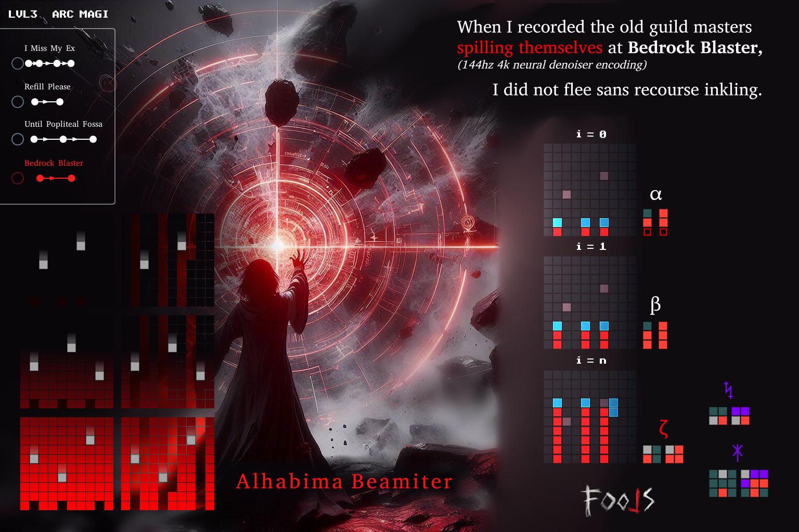

Alphabet Hash Bijection Mask is an algorithm I developed to solve abstraction generalization for ARC-AGI 2024.
The algorithm works by extracting a unique tensor alphabet hierarchically and iteratively: with the smallest delta shape of certainty being substituted.
